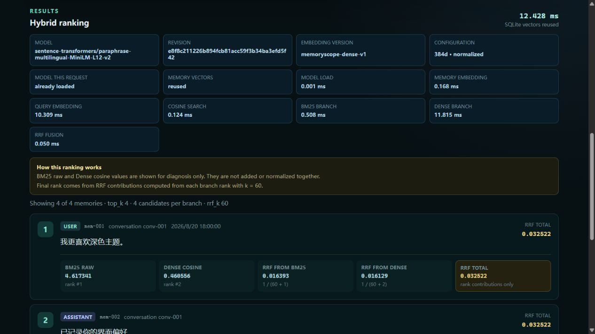
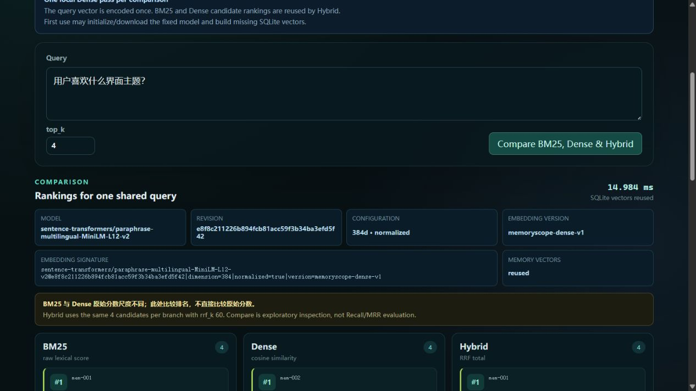
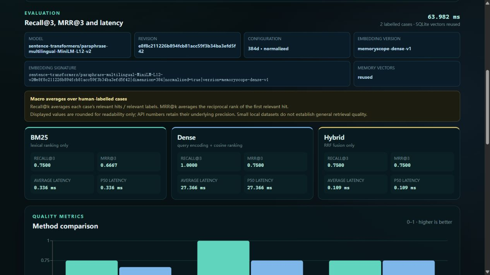
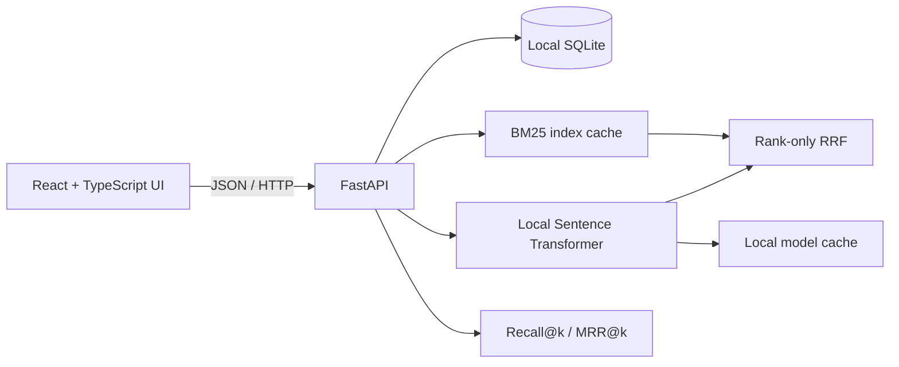

# MemoryScope

MemoryScope v0.1.0 is a local-first, single-user tool for understanding how an agent retrieves conversation memories. Import a strict JSON dataset, search one-message memories with BM25, local Dense, or explainable Hybrid RRF, compare rankings and latency, and evaluate retrieval against human-provided relevance labels.

MemoryScope started as an independent project in an empty repository. It does not copy source code, structure, data, charts, or prose from the earlier group project.

## What is included

- Strict schema 0.1 JSON validation and all-or-nothing import
- Local SQLite persistence, paginated memory preview, and cascading deletion
- Deterministic multilingual BM25 with `rank-bm25`
- Local CPU Dense retrieval with a revision-pinned multilingual Sentence Transformer
- Exact cosine similarity over persisted float32 embeddings
- Explainable Hybrid ranking with Reciprocal Rank Fusion (`rrf_k = 60`)
- One-query BM25, Dense, and Hybrid rank comparison with stage timings
- Label-based macro Recall@k, MRR@k, average latency, and P50 latency
- Responsive React interface with explicit loading, empty, and error states
- FastAPI tests that use an injected fake embedding provider and never download the model

## Interface

All screenshots use the fictional dataset in `examples/sample-dataset.json`.

### Search



### Compare methods



### Evaluation



## Technology stack

| Layer | Technology |
| --- | --- |
| Frontend | React 19, TypeScript 5.9, Vite 8, Recharts 3 |
| API | Python 3.11+, FastAPI, Uvicorn |
| Storage | SQLite with float32 embedding BLOBs |
| Retrieval | `rank-bm25`, Sentence Transformers, NumPy exact cosine, RRF |
| Verification | pytest, TypeScript compiler, Vite production build |

## Architecture



Conversation content, evaluation labels, and embeddings stay in the local SQLite database. The only expected runtime network access is the first download of the public Dense model when it is not already cached.

## Requirements

- Git
- Python 3.11 or newer
- Node.js 22.12 or newer
- pnpm 11.19.0

Install the pinned package manager if needed:

```text
npm install --global pnpm@11.19.0
```

No paid API, API key, external database, or vector service is required.

## Quick start on Windows PowerShell

From the repository root:

```powershell
.\scripts\setup.ps1
```

If local script execution is disabled, enable it only for the current PowerShell process:

```powershell
Set-ExecutionPolicy -Scope Process -ExecutionPolicy Bypass
```

Start the backend in the first terminal:

```powershell
.\scripts\start-backend.ps1
```

Start the frontend in a second terminal:

```powershell
.\scripts\start-frontend.ps1
```

Open <http://127.0.0.1:5173>. The health endpoint is <http://127.0.0.1:8000/api/v1/health>, and interactive OpenAPI documentation is at <http://127.0.0.1:8000/docs>.

## Quick start on macOS or Linux

From the repository root:

```bash
npm install --global pnpm@11.19.0
bash ./scripts/setup.sh
```

Start the backend in the first terminal:

```bash
bash ./scripts/start-backend.sh
```

Start the frontend in a second terminal:

```bash
bash ./scripts/start-frontend.sh
```

Then open <http://127.0.0.1:5173>.

## Manual startup

The scripts above are deliberately small and run each service in the foreground. The equivalent manual commands are:

### Backend

Windows PowerShell:

```powershell
Set-Location .\backend
python -m venv .venv
.\.venv\Scripts\python.exe -m pip install -e ".[dev]"
.\.venv\Scripts\python.exe -m uvicorn app.main:app --host 127.0.0.1 --port 8000
```

macOS/Linux:

```bash
cd backend
python3 -m venv .venv
./.venv/bin/python -m pip install -e ".[dev]"
./.venv/bin/python -m uvicorn app.main:app --host 127.0.0.1 --port 8000
```

### Frontend

```text
cd frontend
pnpm install --frozen-lockfile
pnpm run dev -- --host 127.0.0.1
```

## Import and explore the example

1. Open the frontend and choose `examples/sample-dataset.json` in the file picker, or drop it onto the import area.
2. Open the imported dataset to preview message-level memories.
3. Choose **Search**, then run BM25, Dense, or Hybrid for `用户喜欢什么界面主题？`.
4. Switch to **Compare Methods** to align the three top-k rankings.
5. Open **Evaluation** and run the two included evaluation cases.

PowerShell import example:

```powershell
$sampleJson = Get-Content -Raw .\examples\sample-dataset.json
Invoke-RestMethod `
  -Uri http://127.0.0.1:8000/api/v1/datasets/import `
  -Method Post `
  -ContentType application/json `
  -Body $sampleJson
```

Import is atomic: any invalid message, role, ID, relevance reference, limit, or JSON structure rolls back the entire dataset.

## Data and evaluation format

Each JSON document has `schema_version`, `name`, and `conversations`. Each message requires `id`, `role`, and non-empty `content`; `timestamp` and `metadata` are optional. One message is one retrievable memory—MemoryScope never chunks it automatically.

Optional `evaluation_cases` contain a query and one or more `relevant_memory_ids` that must reference messages in the same dataset. For each case:

- `Recall@k = retrieved relevant count / relevant message count`.
- `RR@k = 1 / r` when the first relevant memory occurs at one-based rank `r <= k`; otherwise it is `0`.
- Dataset Recall@k and MRR@k are macro averages, so each case has equal weight.
- P50 is the standard median; for an even case count it averages the two middle latency values.

Preparation such as model initialization and vector construction is reported separately. BM25 latency is lexical scoring/ranking, Dense latency is query encoding plus exact cosine ranking, and Hybrid latency is RRF fusion over already computed ranks.

See [data format](docs/data-format.md), [API reference](docs/api.md), and [product specification](docs/product-spec.md) for full contracts and limits.

## Retrieval score semantics

Hybrid uses `min(N, max(100, 5 * top_k))` candidates per BM25 and Dense branch. A candidate contributes `1 / (60 + rank)` from each branch it entered, and zero otherwise. Stable ties use ascending `memory_id`.

BM25 raw scores and Dense cosine similarities use different scales. MemoryScope never directly adds, jointly normalizes, or presents them as comparable measurements; Hybrid combines only their ranks.

## Run verification

Backend tests:

```powershell
Set-Location .\backend
.\.venv\Scripts\python.exe -m pytest --basetemp .pytest-tmp
```

Frontend type check and production build:

```powershell
Set-Location .\frontend
pnpm run typecheck
pnpm run build
```

The same commands run in `.github/workflows/ci.yml` on pull requests and pushes to `main`. CI forces model libraries into offline mode; tests inject a fake embedding provider and do not download model weights.

## Configuration, privacy, and offline behavior

Defaults work without a `.env` file. Copy `.env.example` to `.env` only when overriding the local database path, allowed frontend origins, model cache path, offline mode, or frontend API address. `.env` is ignored by Git.

Imported conversations are processed locally and are not uploaded by MemoryScope. Dense retrieval is also local after model installation, but first use can contact Hugging Face to download the public model:

- Model: `sentence-transformers/paraphrase-multilingual-MiniLM-L12-v2`
- Revision: `e8f8c211226b894fcb81acc59f3b34ba3efd5f42`
- Default cache: `backend/.model-cache`
- Approximate cache size: 480 MiB; filesystem and dependency versions can change the exact size

Set `MEMORYSCOPE_MODEL_OFFLINE=true` only after the complete pinned revision is cached. Without a complete cache, offline Dense, Hybrid, Compare, and Evaluation requests return a model initialization error; BM25 remains available. On Windows without Developer Mode, Hugging Face may use ordinary files instead of symlinks and temporarily consume more disk space.

## Known limitations

- Local, single-user development tool; there is no authentication or hosted service.
- A dataset is limited to 5,000 messages, 200 evaluation cases, a 20 MiB JSON file, and 20,000 characters per message.
- SQLite has limited write concurrency and is not intended for multi-process ingestion.
- Dense CPU cold start is comparatively slow and the pinned model cache is about 480 MiB.
- Cosine retrieval scans every memory exactly; there is no ANN, FAISS, HNSW, or vector database.
- Chinese BM25 tokenization uses simplified character unigrams and adjacent bigrams rather than linguistic segmentation.
- BM25 raw scores and Dense cosine scores cannot be directly compared.
- Recall and MRR depend on manually supplied `relevant_memory_ids`; small local datasets do not establish general retrieval quality or statistical significance.
- Evaluation history, automatic labeling, reranking, live agent integration, and multi-dataset benchmarking are not implemented.

## Roadmap

Possible post-v0.1.0 work includes saved evaluation runs, additional explicitly labelled metrics, exportable reports, and larger-dataset indexing. These are not part of the current release.

## License

MemoryScope is released under the [MIT License](LICENSE).
